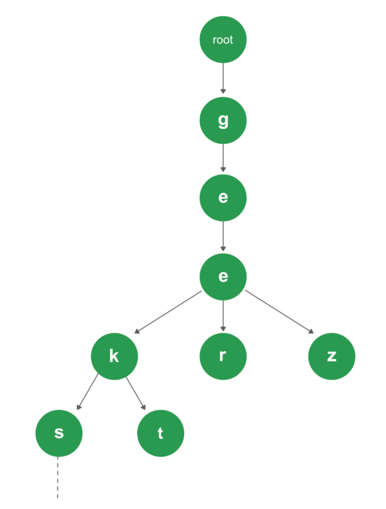

# Trie 
- Re`trie`val data structure
- Time complexity : O(M)



```
class Trie
    public: 
        Trie() {}
        void insert(string s) {
            Trie* curr = this;
            for(char ch : s) {
                int index = ch - 'a';
                // 1. check if children of certain character node
                if(curr -> children[index] == nullptn) {
                    curr -> children[index] = new Trie();
                }
                // 2. if all condition fulfilled then go down to child
                curr = curr -> child[index];
            }
            curr -> isEnd = true;
        }
        int search(string s) {
            Trie* curr = this;
            for(char ch : s) {
                int index = ch - 'a';
                // condition
                curr = curr -> children[index];
            }
            // return when any condition is not satisfied
        }
    private:
        Trie* child[26];
        bool isEnd;

```